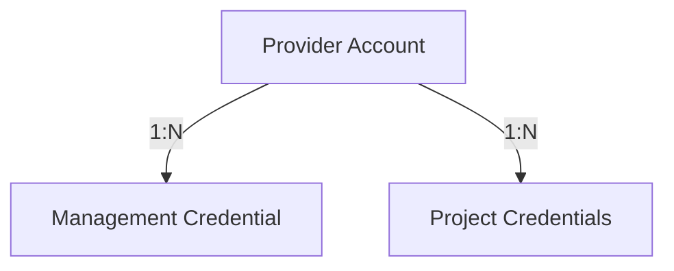

# Provider Credential Architecture

This document outlines the architecture for managing highly privileged credentials (e.g., Supabase Management API Tokens / Personal Access Tokens) across multiple provider accounts in the Infrastructure Engine.

## The Problem
Historically, `project_credentials` stored secrets (like `anon_key` and `service_role_key`) directly on each project row.
However, a **Management API Token** operates at the **Account/Organization** level, not the project level. If we stored it inside `project_credentials`, we would face severe issues:
- **Duplication**: The same token repeated across 50 projects.
- **Rotation Nightmare**: Updating the token requires updating 50 rows.
- **Security Leakage**: UI queries targeting `project_credentials` risk exposing the highly privileged token alongside normal project metadata.

## The Solution: Account-Level Isolation

We introduced two new entities that separate credentials from projects:
1. `provider_accounts`: Represents a top-level provider organization/account.
2. `provider_management_credentials`: Stores the encrypted tokens.

**Relationship:**


### Encryption / Decryption Boundary
Secrets are **NEVER** stored in plaintext. They are encrypted using `aes-256-cbc` via `lib/crypto.ts` before insertion into the database.

The **Server-Only Boundary** strictly dictates:
- Encrypted secrets live in the database.
- Decryption happens purely on the Node.js server inside the `CredentialResolver`.
- Plaintext secrets are injected directly into the Provider (e.g. `SupabaseProvider`).
- **CRITICAL:** Plaintext secrets are NEVER serialized, NEVER passed to a Server Action return object, NEVER logged, and NEVER sent to the UI.

### Credential Resolver Flow
```text
Project
   ↓
Provider Account ID
   ↓
Credential Resolver (Server-Side)
   ↓ (Filters by accountId, provider, and credential_type)
Encrypted Secret (from DB)
   ↓
Decrypt (lib/crypto.ts)
   ↓
Decrypted Secret
   ↓
Infrastructure Provider -> Management API
```

### Multi-Account Isolation
The `CredentialResolver` forces database-level filtering. 
When `resolveCredential(accountId, 'Supabase', 'management_api')` is called, it explicitly restricts the query to `provider_account_id = accountId`.
This physically prevents Project A (belonging to Account 1) from ever accessing the Management API token of Account 2.

### Secret Rotation Strategy
Because tokens are stored at the Account level:
1. A new `provider_management_credentials` row is inserted for the account with the new encrypted token and `status = 'active'`.
2. The old credential's status is changed to `revoked`.
3. All projects under that account instantly start using the new token on their next server-side request. Zero project rows need modification.

## Backward Compatibility
To ensure older projects do not break, the `provider_account_id` on the `project_credentials` table is **nullable**. Projects without an account simply cannot use features that require Management Credentials (like the Wake Engine) and will safely fall back to `status: unsupported`.

## Credential Management Flow
To securely enter and rotate credentials, we use a distinct boundary between the Browser and the Database:
```text
Browser
  |
  | PAT submission (Plaintext)
  v
Server Action
  |
  | (Plaintext)
  v
Credential Management Service
  |
  | encrypt()
  v
Database (provider_management_credentials)
  |
  | (Encrypted token only)
```

**Client/Server Boundary:** The plaintext PAT is ONLY used temporarily in server-side execution. It is never persisted to disk, logged, or returned to the client. The UI receives only clean `ManagementCredentialMetadata`.

**Logging Security:** All logs from the `CredentialManagementService` omit the encrypted token, decrypted token, or the payload bodies containing the secret.

**Why PAT Cannot Be Retrieved:** Once submitted, the PAT is encrypted and the plaintext is discarded. The application does not provide any API, route, or Server Action that decrypts the token back to the frontend.

## Wake Engine Connection & Execution (FROZEN)
> [!WARNING]
> The Wake Engine is explicitly **frozen** and is **NOT** part of the production Keep-Alive flow. 

The Wake Engine would require a Management API Token (PAT) to unpause projects via the provider's control plane (`api.supabase.com/v1/projects/{ref}/restore`). 
However, based on the final security audit and production architecture, the **Keep-Alive mechanism exclusively uses the `anon_key`** against the `PostgREST` endpoint (`GET /rest/v1/?limit=1`) to prevent projects from sleeping by simulating legitimate compute activity.

**Key constraints of the final architecture:**
1. PAT / Management API Tokens are NOT used for automation.
2. Wake Engine is disabled (`WAKE_ENABLED = false`).
3. `anon_key` is securely decrypted server-side solely for the purpose of the read-only Keep-Alive request.
